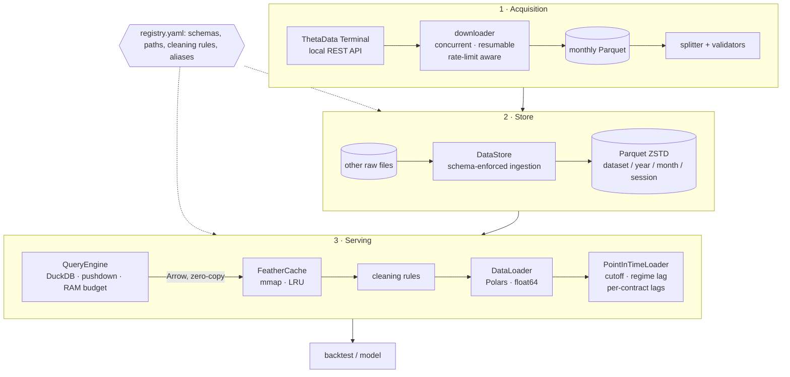

# SPX Options Pipeline

**A point-in-time data lake for SPX / SPXW options research.**
Parquet + DuckDB + Polars, with look-ahead guards on every path that feeds a backtest.

[](https://github.com/Elias-outofsample/spx-options-pipeline/actions/workflows/ci.yml)


[](LICENSE)

Options backtests usually fail in the data layer, and they fail silently: a Greek
computed at 10:00 used to trade at 10:00, a daily volatility regime computed at the close
used intraday, a deduplication that collapses a whole option chain into one row per
minute. This project is the data layer built for short-dated (0DTE–7DTE) SPX options
research — **one-minute Greeks for eight expiries since 2019, quotes, implied-volatility
surfaces, open interest and trade prints** — ingested once into a partitioned Parquet
store and served through a loader that makes look-ahead hard to write.

## Try it in 30 seconds — no data subscription needed

```bash
git clone https://github.com/Elias-outofsample/spx-options-pipeline && cd spx-options-pipeline
pip install -e .
spx-pipeline demo
```

The demo generates a self-consistent synthetic market (GBM underlying, mean-reverting VIX,
a Black-Scholes option chain on a skewed smile — including the vendor feed's known
defects), then runs the real pipeline on it:

```text
[2/5] Ingest into the store: schema enforced, Parquet ZSTD, year=/month= partitions
      46 files -> 22.4 MB under store/, one file per session  (0.9s)

[3/5] Query a slice of the chain: filters pushed down to the Parquet reader
      greeks_0dte 2024-01-03  PUT  4680 <= strike <= 4780: 8,162 rows
      first query 28 ms, repeat 4.2 ms (memory-mapped Arrow cache)

[4/5] What the cleaning rules removed from greeks_0dte on 2024-01-02
      raw rows: 31,980
      - filter_bogus_expirations         -82 rows   OPRA test contracts (expiry 1882)
      - drop_opening_bar                 -82 rows   09:30 bar: underlying = 0, IV overflow
      - filter_illiquid                  -85 rows   zero bid / IV > 100 / no underlying
      - add_mid                     adds a column   mid = (bid + ask) / 2

[5/5] Point-in-time guarantees
      cutoff 2024-01-04: asked up to 2024-01-12, last bar returned 2024-01-04 15:59
      regime lag: bars of 2024-01-04 carry the regime of the 2024-01-03 close (vix 14.26)  OK
      per-contract feature lag: delta_lag1 of the 4680 put at 09:32 is its own 09:31 delta, not a neighbour's  OK
```

## Architecture



Every dataset is declared once in [`registry.yaml`](src/spx_pipeline/registry.yaml) —
paths, Arrow schema, dropped columns, ordered cleaning rules. The code never special-cases
a dataset by name: adding a standard dataset is a YAML block ([docs/extending.md](docs/extending.md)).

## What's inside

| Component | What it does | Why it matters |
|---|---|---|
| **Registry** | 20 datasets (index bars, Greeks 0–7 DTE, quotes, IV, OI, EOD, trades, tick Greeks, daily regime) from one YAML, with legacy aliases | One source of truth; new data without new code |
| **Store** | Hive-partitioned Parquet (ZSTD), one file per session, float32 on disk; idempotent, one file at a time, multi-GB bulk files streamed in 1M-row batches | Bounded memory and disk; re-ingestion is cheap and safe |
| **Query engine** | DuckDB with partition pruning and predicate pushdown, bind parameters, quoted identifiers, memory limit; days-to-expiry derived at query time | Reads only the row groups a query can match |
| **Cache** | Uncompressed Feather, memory-mapped, SHA-256 keys, LRU eviction | Repeat queries in ~2 ms without copying data into RAM |
| **Cleaning** | 12 pure rules: opening-bar corruption, illiquid quotes, OPRA test contracts, stale zero prints, spread outliers, duplicates… | Vendor quirks handled once, visibly, and reversibly |
| **Point-in-time loader** | Cutoff clamp, regime lag ≥ 1 session, per-contract feature lags | Walk-forward research without look-ahead — see [docs/point-in-time.md](docs/point-in-time.md) |
| **Acquisition** | ThetaData downloader (semaphore-bounded concurrency, exponential back-off, resume journal) + ~30-check raw-data validator | Six years of data pulled and verified reproducibly |
| **Synthetic feed** | Black-Scholes chain with analytic Greeks, reproduces the feed's defects | Demo, tests and benchmarks without licensed data |

```python
from datetime import date
from spx_pipeline import DataLoader, PointInTimeLoader

loader = DataLoader(store_root="data")                      # directory holding store/
puts = loader.load("greeks_0dte", "2024-03-15",
                   filters=[("right", "=", "PUT"), ("strike", ">=", 5000)])
aligned = loader.load_aligned(("2024-03-11", "2024-03-15"),
                              datasets=["spx_ohlc", "vix_ohlc", "vol_regime"])

pit = PointInTimeLoader(loader, cutoff_date=date(2024, 3, 14), feature_lag_bars=1)
train = pit.with_feature_lag(pit.load("greeks_0dte", ("2024-01-02", "2024-03-31")),
                             ["delta", "implied_vol"])      # rows after 2024-03-14 never appear
```

## Measured

Reproducible on synthetic data with `python benchmarks/bench.py` (Linux, 4 CPUs,
Python 3.12; 15 sessions, 479,700 option rows):

| Operation | Time |
|---|---|
| Ingestion (schema cast + ZSTD write) | ≈ 0.9 M rows/s |
| One session, whole 0DTE chain | 36 ms |
| One session, put band 4700–4750 (pushdown) | 12.5 ms |
| 15 sessions, same band | 47 ms |
| Same band, cache hit (memory-mapped Arrow) | 2.0 ms |

On the private store it was built for (licensed ThetaData feed, not included): eight
Greeks datasets from 2019, 1,425–1,491 sessions each at roughly 130,000 one-minute rows
per session, plus quotes, IV surfaces, open interest, end-of-day chains and trades.

## Hardening before release

Before publishing, the pipeline was audited end to end and every defect found got a
regression test in [`tests/test_regressions.py`](tests/test_regressions.py). Each test
below **fails on the previous implementation** (replayed to check):

| Defect | Consequence | Fix |
|---|---|---|
| Feature lag shifted rows across the whole chain | A contract's "lagged" Greek was its neighbour's value *at the same minute* — look-ahead, not a lag | Shift within each contract (`shift(n).over(contract key)`) |
| Duplicate filter keyed on (timestamp, symbol) | Tick Greeks collapsed to one row per timestamp | Key on the full contract identity |
| Bulk-file store path formatted `{month:02d}` with a string | Every bulk tick file failed; only an error counter showed it | Pass the month as an integer |
| Per-day tick sources routed to the bulk reader | `trades_0dte` ingested nothing | Route on the path layout, not the granularity |
| Date range only applied to columns named `timestamp` or `date` | `eod` (indexed on `created`) returned every session for any query | Filter on the declared type of the index column |
| Illiquidity filter hard-wired to `implied_vol` | Tick Greeks (`iv`) raised on load | Accept either IV column |
| Daily regime read over the window only | The first session of every window had no regime | Read a look-back, shift, trim |

Also tightened: identifiers are always quoted and the memory budget validated before it
reaches SQL, `assert`-based validation replaced by exceptions, logging no longer
configured at import time, and weak tests (`assert True`, assertions skipped on empty
frames) rewritten to check real values. The test fixture also wrote the daily regime where
the registry never looks, so no test had ever loaded it; regime alignment is now tested.

## Project layout

```text
src/spx_pipeline/
├── registry.yaml / registry.py   dataset declarations → typed configs
├── store.py                      raw → store ingestion
├── query.py                      DuckDB query engine
├── cache.py                      memory-mapped Feather cache
├── cleaning.py                   cleaning rules
├── loader.py                     DataLoader
├── pit.py                        PointInTimeLoader
├── synthetic.py                  synthetic market + Black-Scholes chain
├── cli.py                        spx-pipeline <command>
├── tools/                        migrate · validate · regime
└── vendors/thetadata/            downloader · splitter · validators · terminal launcher
tests/                            107 tests, synthetic data only
benchmarks/bench.py               reproducible micro-benchmark
docs/                             architecture · point-in-time · extending · data acquisition
```

## Development

```bash
pip install -e ".[dev]"
pytest                      # 107 tests, ~13 s, no data or network needed
ruff check src tests && mypy src/spx_pipeline --exclude vendors
```

CI runs lint, type checks and the suite on Python 3.11, 3.12 and 3.13, then the demo.

## Data and limitations

- **No market data is included.** The real store is built from ThetaData, a licensed
  feed; [docs/thetadata.md](docs/thetadata.md) describes the acquisition path. The
  synthetic generator exercises the plumbing and carries no market signal.
- Timestamps are naive US/Eastern (the CBOE wall clock) — enforced at ingestion for
  options datasets.
- The business-day calendar used by the synthetic feed ignores exchange holidays.
- Single-machine by design: DuckDB and the Feather cache run in-process. Beyond a few
  hundred GB of tick data the next step is object storage and a table format
  (Iceberg/Delta) rather than more local disk.

## License

All rights reserved: the code is public for review, not for reuse — see [LICENSE](LICENSE).
